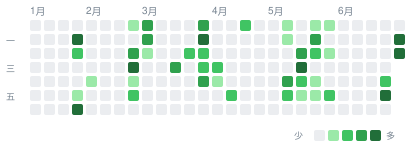

 

## 目录导航

<!-- AUTOGEN:tree -->

| 科目 | 笔记数 | 字数 | 占比 |
| :--- | :---: | :---: | :--- |
| [线性代数](./%E7%BA%BF%E6%80%A7%E4%BB%A3%E6%95%B0) | `72` | `15.6万` | `████████████████████` 68% |
| [微积分](./%E5%BE%AE%E7%A7%AF%E5%88%86) | `75` | `6.1万` | `████████░░░░░░░░░░░░` 27% |
<!-- /AUTOGEN:tree -->

 

## 活跃热力图

近 26 周每日提交密度 · 颜色越深记录越多

<!-- AUTOGEN:heatmap -->

<!-- /AUTOGEN:heatmap -->

 

## 日志

<!-- AUTOGEN:timeline -->
- `07-03` · docs: 重构 README（极简 banner + 字数占比 + GitHub 风格热力图 + 日志） -1天前
- `07-03` · feat: README 自动化（Action 生成统计/目录/热力图/时间轴） 3小时前
- `07-03` · feat: Obsidian Git 接入 DeepSeek 自动生成 commit message 3小时前
- `07-03` · 迁移 C++ 源码至 学科笔记/C++代码 4小时前
- `07-02` · docs: README 改用渐变动效流风格（波浪 banner + 打字机字幕 + 折叠卡片） 昨天
- `07-02` · docs: 重写 README 目录导航；移除失效的自动更新 workflow 昨天
- `05-25` · dify 1个月前
- `05-20` · fix: 更新 README.md 中时间线和目录树的正则表达式 1个月前
- `05-20` · fix: update regex patterns for timeline and tree sections in README.md 1个月前
- `05-20` · feat: complete deepseek auto summary workflow 1个月前
<!-- /AUTOGEN:timeline -->

 

## 最近笔记

<!-- AUTOGEN:recent -->

| 笔记 | 科目 |
| :--- | :--- |
| [调试](./C%2B%2B/cppCherno/11DEBUG/%E8%B0%83%E8%AF%95.md) | C++ |
| [note](./C%2B%2B/cppCherno/12conditions/note.md) | C++ |
| [note](./C%2B%2B/cppCherno/14loops/note.md) | C++ |
| [指针](./C%2B%2B/cppCherno/16pointers/%E6%8C%87%E9%92%88.md) | C++ |
| [引用](./C%2B%2B/cppCherno/17reference/%E5%BC%95%E7%94%A8.md) | C++ |
| [类](./C%2B%2B/cppCherno/18classes/%E7%B1%BB.md) | C++ |
| [结构体和类](./C%2B%2B/cppCherno/19classVSstruct/%E7%BB%93%E6%9E%84%E4%BD%93%E5%92%8C%E7%B1%BB.md) | C++ |
| [logclass](./C%2B%2B/cppCherno/20logclass/logclass.md) | C++ |
<!-- /AUTOGEN:recent -->

 

<!-- AUTOGEN:stats -->
178 篇笔记 · 22.9万字 · 8 个科目 · 157 处双向链接 · 连续记录 2 天
<!-- /AUTOGEN:stats -->

