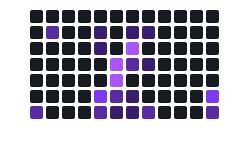

<div align="center">


<a href="https://github.com/w23x0/obsidian">
  
</a>

<br/>

<!-- AUTOGEN:badges -->
<div align="center">


</div>
<!-- /AUTOGEN:badges -->

</div>

<br/>

## 🗂️ 目录导航

<!-- AUTOGEN:tree -->

| 科目 | 笔记数 | 字数 | 占比 |
| :--- | :---: | :---: | :--- |
| [微积分](./%E5%BE%AE%E7%A7%AF%E5%88%86) | `75` | `6.1万` | `████████████████████` 42% |
| [线性代数](./%E7%BA%BF%E6%80%A7%E4%BB%A3%E6%95%B0) | `72` | `15.6万` | `███████████████████░` 40% |
| [C++](./C%2B%2B) | `19` | `8142` | `█████░░░░░░░░░░░░░░░` 11% |
| [AI模型](./AI%E6%A8%A1%E5%9E%8B) | `8` | `89` | `██░░░░░░░░░░░░░░░░░░` 4% |
| [LaTeX](./LaTeX) | `1` | `1614` | `░░░░░░░░░░░░░░░░░░░░` 1% |
| [MATLAB](./MATLAB) | `1` | `16` | `░░░░░░░░░░░░░░░░░░░░` 1% |
| [数字电路](./%E6%95%B0%E5%AD%97%E7%94%B5%E8%B7%AF) | `1` | `848` | `░░░░░░░░░░░░░░░░░░░░` 1% |
| [模拟电路](./%E6%A8%A1%E6%8B%9F%E7%94%B5%E8%B7%AF) | `1` | `1362` | `░░░░░░░░░░░░░░░░░░░░` 1% |
<!-- /AUTOGEN:tree -->

<br/>

## 📊 笔记活跃热力图

<sub>近 12 周每日提交密度 · 颜色越深记录越多</sub>

<!-- AUTOGEN:heatmap -->

<!-- /AUTOGEN:heatmap -->

<br/>

## 📅 更新时间轴

<!-- AUTOGEN:timeline -->
- 📝 `07-03 00:48` · 迁移 C++ 源码至 学科笔记/C++代码 <sub>1小时前</sub>
- 📝 `07-02 00:16` · docs: README 改用渐变动效流风格（波浪 banner + 打字机字幕 + 折叠卡片） <sub>昨天</sub>
- 📝 `07-02 00:11` · docs: 重写 README 目录导航；移除失效的自动更新 workflow <sub>昨天</sub>
- 📝 `05-24 16:11` · docs: auto updated study timeline and coverage <sub>1个月前</sub>
- 📝 `05-25 00:10` · dify <sub>1个月前</sub>
- 📝 `05-21 17:52` · Merge remote-tracking branch 'origin/main' <sub>1个月前</sub>
- 📝 `05-20 16:38` · docs: auto updated study timeline and coverage <sub>1个月前</sub>
- 📝 `05-20 10:11` · Merge remote-tracking branch 'origin/main' <sub>1个月前</sub>
- 📝 `05-20 02:01` · docs: auto updated study timeline and coverage <sub>1个月前</sub>
- 📝 `05-19 17:21` · docs: auto updated study timeline and coverage <sub>1个月前</sub>
<!-- /AUTOGEN:timeline -->

<br/>

## 📝 最近笔记

<!-- AUTOGEN:recent -->
- [调试](./C%2B%2B/cppCherno/11DEBUG/%E8%B0%83%E8%AF%95.md) <sub>刚刚</sub>
- [note](./C%2B%2B/cppCherno/12conditions/note.md) <sub>刚刚</sub>
- [note](./C%2B%2B/cppCherno/14loops/note.md) <sub>刚刚</sub>
- [指针](./C%2B%2B/cppCherno/16pointers/%E6%8C%87%E9%92%88.md) <sub>刚刚</sub>
- [引用](./C%2B%2B/cppCherno/17reference/%E5%BC%95%E7%94%A8.md) <sub>刚刚</sub>
- [类](./C%2B%2B/cppCherno/18classes/%E7%B1%BB.md) <sub>刚刚</sub>
- [结构体和类](./C%2B%2B/cppCherno/19classVSstruct/%E7%BB%93%E6%9E%84%E4%BD%93%E5%92%8C%E7%B1%BB.md) <sub>刚刚</sub>
- [logclass](./C%2B%2B/cppCherno/20logclass/logclass.md) <sub>刚刚</sub>
<!-- /AUTOGEN:recent -->

<br/>

## 📖 关于本库

> [!NOTE]
> **组织方式**：按学科分目录，每个知识点尽量拆成独立的原子笔记，通过双向链接（`[[...]]`）串联成网。
> **核心积累**：数学部分（微积分 + 线性代数）最完整，是本库的重心所在。

## 🛠️ 如何使用

```bash
git clone https://github.com/w23x0/obsidian.git
```

用 [Obsidian](https://obsidian.md) 打开克隆下来的文件夹作为 Vault，即可获得完整的双向链接与关系图谱体验。直接在 GitHub 上浏览也可以，点上面目录里的链接即可跳转。

> README 中的统计、目录树、热力图、时间轴由 GitHub Action 自动生成（见 `scripts/generate_readme.py`），手写内容不会被覆盖。

<br/>

<div align="center">


</div>
